# MongoDB的操作

#### 一、mongo 与mysql 术语对比

| MySQL | MongoDB | 解释/说明                            |
| -------------- | ---------------- | ------------------------------------ |
| database       | database         | 数据库                               |
| table          | collections      | 数据库表/集合                        |
| row            | document         | 数据记录行/文档                      |
| column         | field            | 数据字段/域                          |
| index          | index            | 索引                                 |
| table joins    | -                | 表链接， MongoDB不支持               |
| primary key    | primary key      | 主键，MongoDB自动将_id字段设置为主键 |

#### 二、 Mysql与MongoDB操作命令对比 
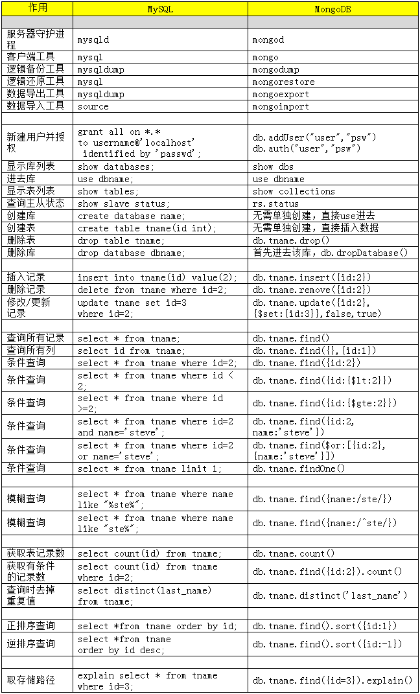
#### 三、 mongodb 增删改查操作
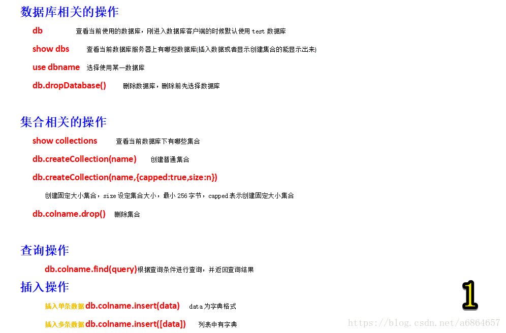
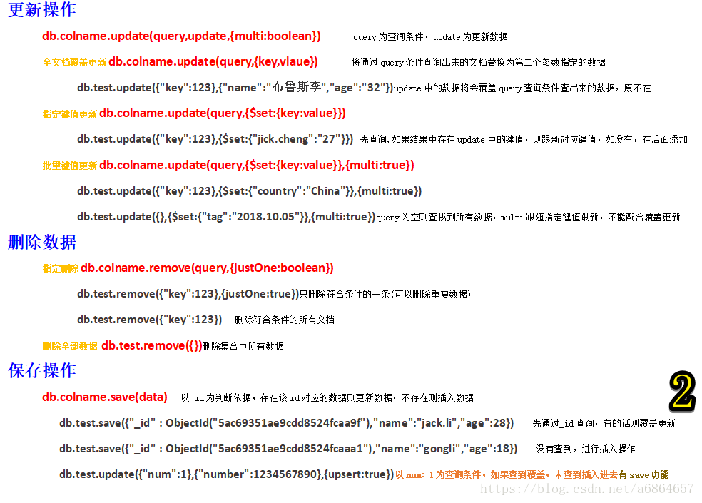
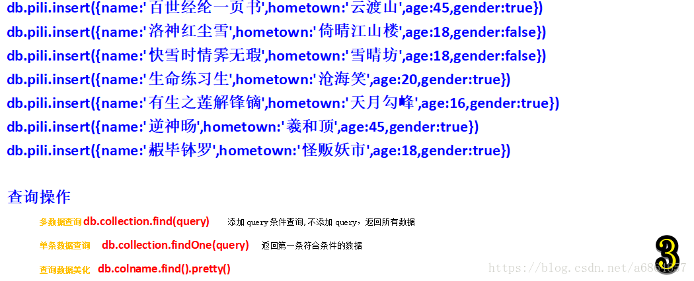

| 比较运算符号 |          | 比较运算符号 |          |
| ------------ | -------- | ------------ | -------- |
| $lt          | 小于     | $gt          | 大于     |
| $lte         | 小于等于 | $gte         | 大于等于 |
| $ne          | 不等于   |           -   |    -      |
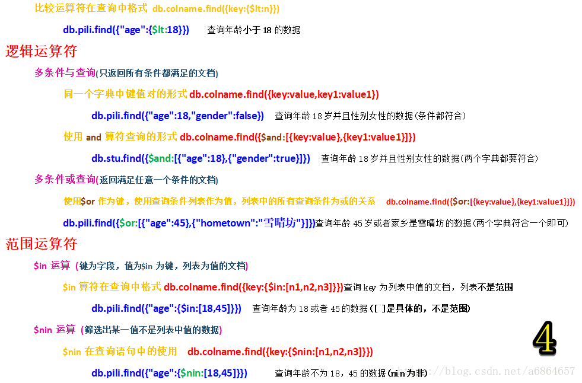
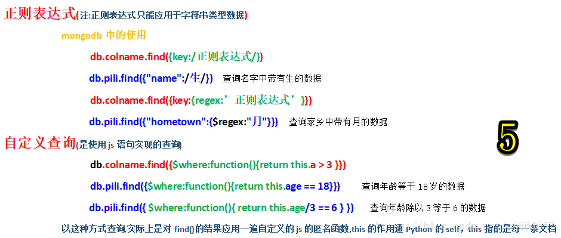
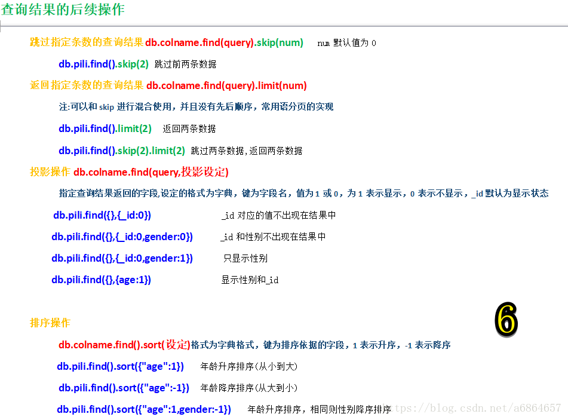
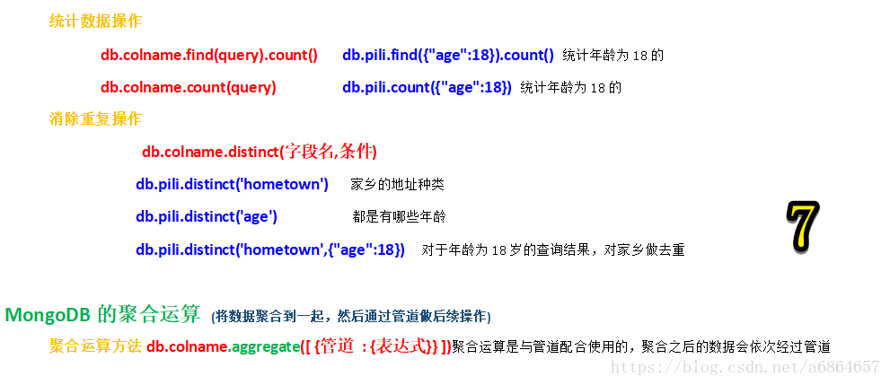
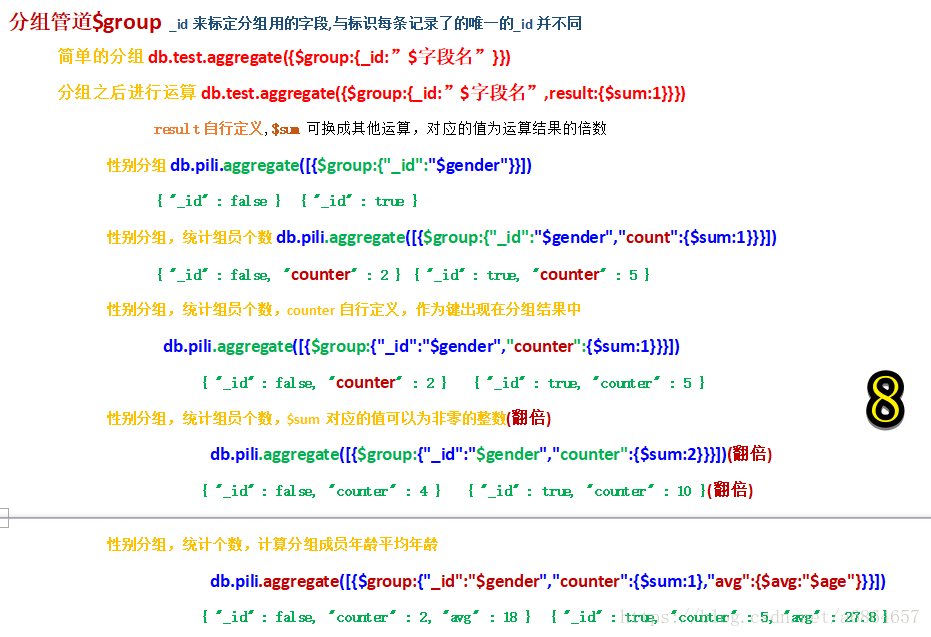
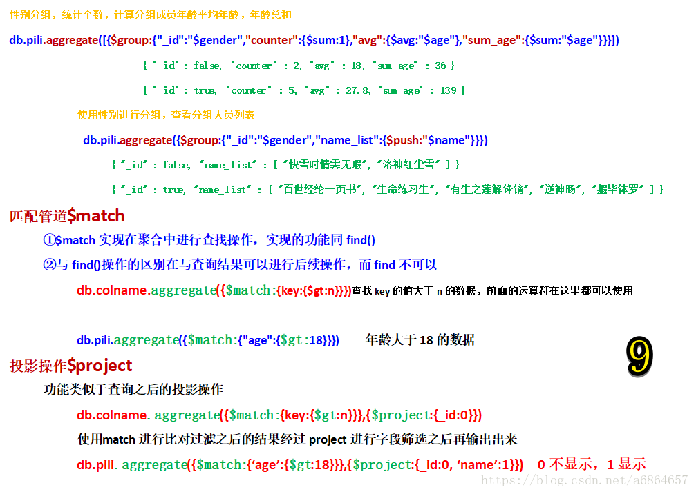
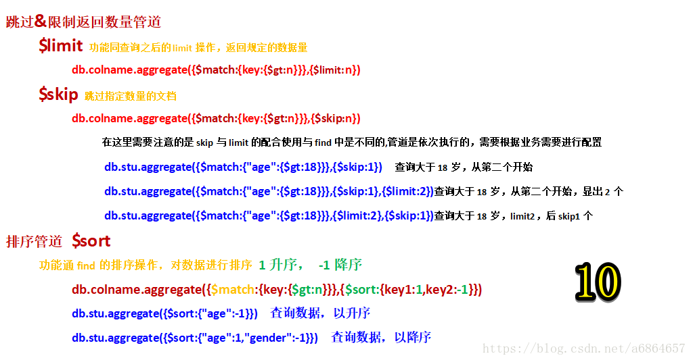