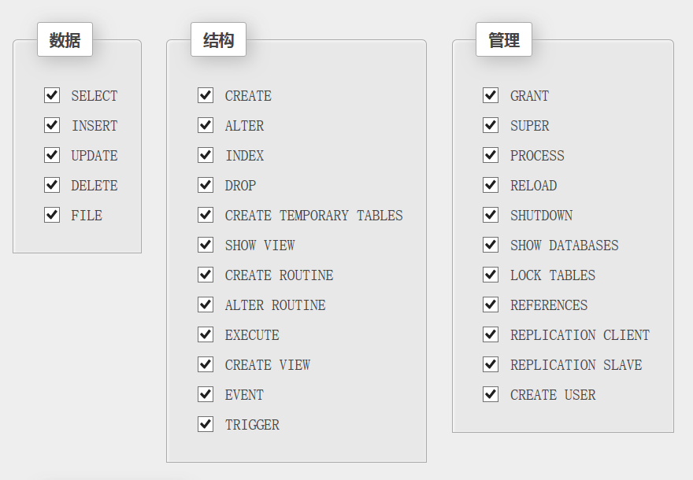

## 第六章 DCL语言



- <b>6.1、创建用户</b>

  ```sql
  CREATE USER '用户名'@'IP地址' IDENTIFIED BY '密码';
  
  create  user  'zhangsan’@'192.168.11111' identifyed  by  '123456';
  create  user  'zhangsan’@'192.168.%' identifyed  by  '123456;
  create  user  'zhangsan’@'%' identifyed  by  '123456';						
  注意：'IP地址'可以设置为localhost(代表本机)或者'%'(代表允许所有IP地址登录)
  ```

- <b>6.2、删除用户 </b>

  ```sql
  DROP USER 用户名@'IP地址';
  DROP USER 'zhangsan'@'localhost'
  
  注意：'IP地址'可以设置为localhost(代表本机)或者'%'(代表允许所有IP地址登录)
  ```

- <b>6.3、用户授权</b>

  ```sql
  GRANT 权限1,权限2,...... ON 数据库名.* TO 用户名@'IP地址' IDENTIFIED BY '密码';
  grant + 权限 + on + 数据库名.数据表明 + to  '用户名';
  
  把在所有数据库的所有表的所有权限赋值给位于所有IP地址的root用户。
  grant all privileges on *.* to root@'%'identified by 'password';
  
  grant  select, insert,update on  bookdb.book  to  'zhangsan';
  grant  all privleges  on   bookdb.book to  'zhangsan';
  
  注意：所有的数据库就用*.*，所有的权限就用all或者all privileges
  ```

- <b>6.4、撤销授权</b>

  ```sql
  REVOKE 权限1,权限2,...... ON 数据库名.* FROM 用户名@'IP地址' IDENTIFIED BY '密码';
  
  revoke 权限列表 on 数据库名.表名 from '用户名'@'主机名';
  REVOKE UPDATE ON db3.`account` FROM 'lisi'@'%';
  
  注意：所有的数据库就用*.*，所有的权限就用all或者all privileges
  ```

- <b>6.5、刷新授权 </b>

  ```sql
  FLUSH PRIVILEGES;
  ```

- <b>6.6、查看授权 </b>

  ```sql
  SHOW GRANTS FOR 用户名@'IP地址';
  SHOW GRANTS FOR 'Simeon'@'%';
  
  注意：'IP地址'可以设置为localhost(代表本机)或者'%'(代表允许所有IP地址登录)
  ```

- <b>6.7、修改密码 </b>

  ```sql
  修改密码
  1. SET PASSWORD = PASSWORD('123456');
  2. UPDATE USER SET PASSWORD=PASSWORD('456') WHERE USER='zhangsan'
  3. SET PASSWORD FOR 'zhangsan'@'localhost'=PASSWORD('456')
  
  登录授权
  GRANT ALL PRIVILEGES ON *.* TO 'root'@'%' IDENTIFIED BY '123456';
刷新授权
  FLUSH PRIVILEGES;
  ```
  

- <b>6.8、修改密码复杂度 </b>

  ```shell
  查看mysql默认密码复杂度 
  SHOW VARIABLES LIKE 'validate_password%';
  
  修改密码复杂度参考
  set global validate_password_policy=LOW;  // 验证密码长度
  set global validate_password_length=6;   // 设置密码长度
  ```