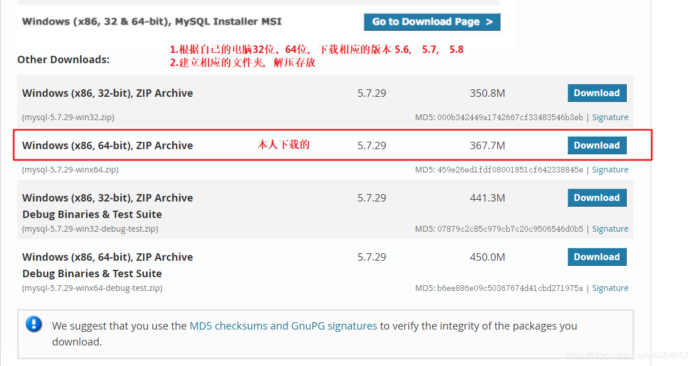
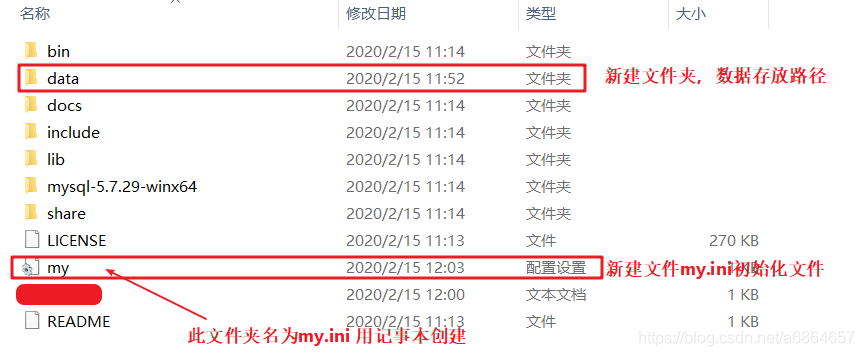
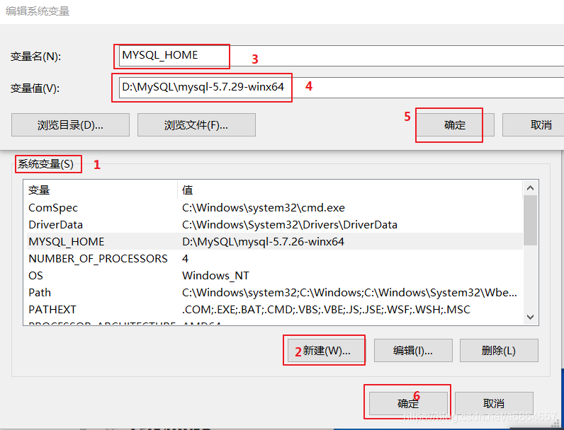
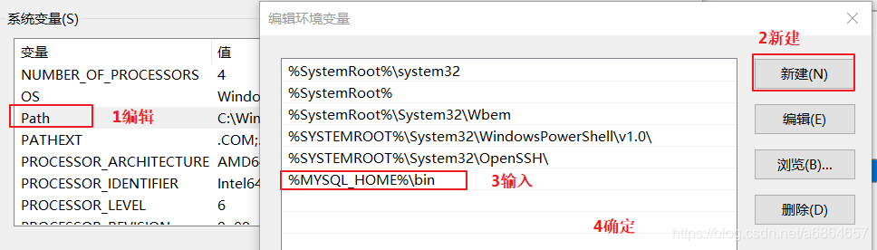
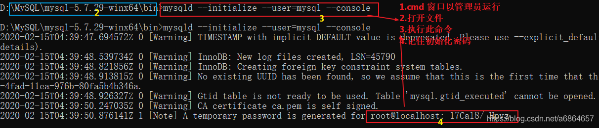
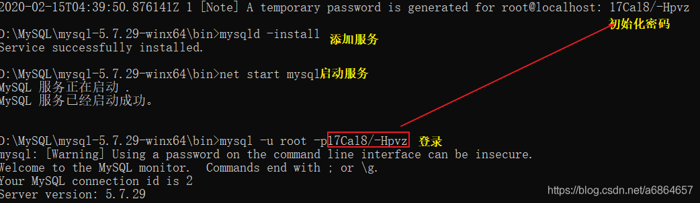

#### 1.3.1 MySQL之windows版本安装

##### 1. 下载
   - [MySQL-download](https://dev.mysql.com/downloads/mysql/)
      


##### 2. 解压到安装目录
	本人解压到D:\MySQL\mysql-5.7.29-winx64<br>
	注：别虎不拉基的用中文命名

##### 3. 配置文件
- 
- my.ini文件内容
  ```python
  [mysqld]
  # 设置3306端口
  port=3306
  # 设置mysql的安装目录
  basedir=D:\\MySQL\\mysql-5.7.29-winx64
  # 设置mysql数据库的数据的存放目录
  datadir=D:\\MySQL\\mysql-5.7.29-winx64\\data
  # 允许最大连接数
  max_connections=200
  # 允许连接失败的次数。这是为了防止有人从该主机试图攻击数据库系统
  max_connect_errors=10
  # 服务端使用的字符集默认为UTF8
  character-set-server=utf8
  # 创建新表时将使用的默认存储引擎
  default-storage-engine=INNODB
  [mysql]
  # 设置mysql客户端默认字符集
  default-character-set=utf8
  [client]
  # 设置mysql客户端连接服务端时默认使用的端口
  port=3306
  default-character-set=utf8
  ```
##### 4. 配置文件

<b>变量名：</b> `MYSQL_HOME`<br>
<b>变量值: </b>`D:\MySQL\mysql-5.7.29-winx64`

<b>path中添加:</b> `%MYSQL_HOME%\bin`
##### 5. 初始化及相应配置


- 初始化命令<font color=red>mysqld --initialize --user=mysql --console</font>
此处本人还报了错误：由于找不到MSVCR120.dll,无法继续执行代码.重新安装程序可能会解决此问题

- 添加服务`mysqld -install`
- 启动服务`net start mysql`
- 登录数据库`mysql -u root -p 密码为初始化密码(上上图)`
- 修改密码：`alter user 'root'@'localhost' identified with mysql_native_password by '1qaz2wsx';`
- 刷新：`FLUSH PRIVILEGES;`


