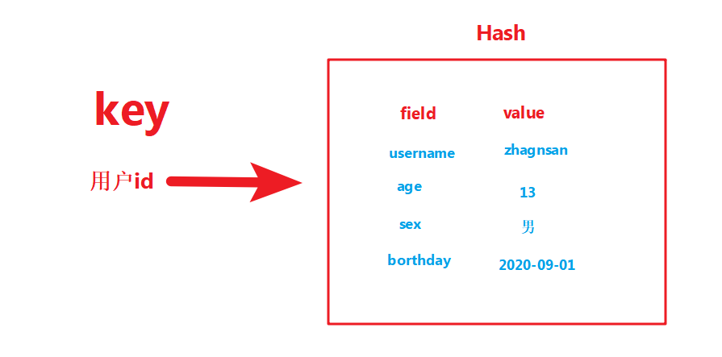

### 2.2.3 Hash哈希基本操作
```python
在Redis中，哈希类型是指键值本身又是一个键值对 结构，
形如value={{field1，value1}，…{fieldN，valueN}}，
添加命令：hset key field value。
哈希可以用来存放用户信息，比如实现购物车
```
<table align="left" border="1" bordercolor="#00BFFF" cellpadding="0" cellspacing="0">
    <caption><strong>常用操作命令如下</strong></caption>
	<tr align="left">
		<td>1</td>
		<td>hset key field value</td>
		<td>设置单个属性<br>将哈希表 key 中的字段 field 的值设为 value</td>
	</tr>
	<tr align="left">
		<td>2</td>
		<td>hkeys key</td>
		<td>获取⼀个属性的值<br>获取存储在哈希表中指定字段的值</td>
	</tr>
	<tr align="left">
		<td>3</td>
		<td>hmset key field1 value1 field2 value2</td>
		<td>设置多个属性<br>同时将多个 field-value (域-值)对设置到哈希表 key 中</td>
	</tr>
	<tr align="left">
		<td>4</td>
		<td>hmget key field1 field2 ...</td>
		<td>获取多个属性的值<br>获取所有给定字段的值</td>
	</tr>
	<tr align="left">
		<td>4</td>
		<td>hmgetall key</td>
		<td>获取在哈希表中指定 key 的所有字段和值</td>
	</tr>
	<tr align="left">
		<td>4</td>
		<td>hexists key field</td>
		<td>查看哈希表key中，指定的字段是否存在</td>
	</tr>
	<tr align="left">
		<td>4</td>
		<td>hsetnx key field value</td>
		<td>只有在字段 field 不存在时，设置哈希表字段的值</td>
	</tr>
	<tr align="left">
		<td>5</td>
		<td>hkeys key</td>
		<td>获取指定键所有的属性</td>
	</tr>
	<tr align="left">
		<td>6</td>
		<td>hvals key</td>
		<td>获取所有属性的值</td>
	</tr>
	<tr align="left">
		<td>7</td>
		<td>del key</td>
		<td>删除整个hash键及值</td>
	</tr>
	<tr align="left">
		<td>8</td>
		<td>hdel key field1 field2 ...</td>
		<td>删除属性，属性对应的值会被⼀起删除<br><font size="2">删除一个或多个哈希表字段</font></td>
	</tr>
</table>


### 散列类型hash

```
设置单个：HSET             语法：HSET key field value，不存在时返回1，存在时返回0，没有更新和插入之分
设置多个：HMSET            语法：HMSET key field value [field value ...]
读取单个：HGET             语法：HGET key field，不存在是返回nil
读取多个：HMGET            语法：HMGET key field [field ...]
读取全部：HGETALL          语法：HGETALL key，返回时字段和字段值的列表
判断字段是否存在：HEXISTS   语法：HEXISTS key field，存在返回1 ，不存在返回0
字段不存在时赋值：HSETNX    语法：HSETNX key field value，与hset命令不同，hsetnx是键不存在时设置值
增加数字：HINCRBY          语法：HINCRBY key field increment ，返回增加后的数，不是整数时会提示错误
删除字段：HDEL             语法：HDEL key field [field ...] ，返回被删除字段的个数
只获取字段名：HKEYS        语法：HKEYS key ，返回键的所有字段名
只获取字段值：HVALS        语法：HVALS key  ，返回键的所有字段值
字段数量：HLEN             语法：HLEN key ，返回字段总数
```


