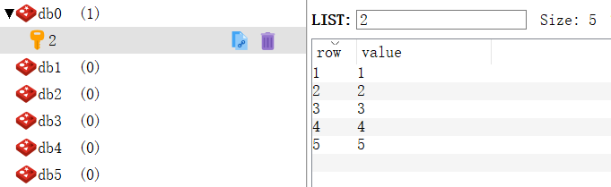
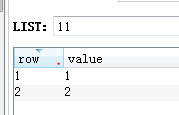
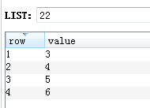
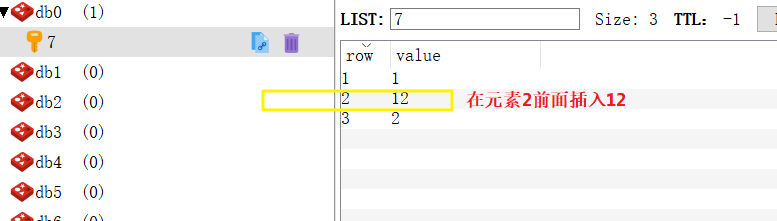

### 2.3.4 python操作redis之list列表

```python
# -*- coding: utf-8 -*-
import redis
r =redis.Redis(host="106.13.168.8",port=6379,password="123456")
```
1. <font color="red">Lpush</font> 命令将一个或多个值插入到列表头部。 <br>如果 key 不存在，一个空列表会被创建并执行 LPUSH 操作。 <br>当 key 存在但不是列表类型时，返回一个错误。<br>
    执行 LPUSH 命令后，列表的长度。

  ```python
  print r.lpush("1",1)  #输出的结果是1
  print r.lpush("1",1)  #输出的结果是2
  print r.lpush("1",2,3,4)  #输出的结果是5
  print r.set("2",1)   #输出的结果是 True
  print r.lpush("2",2)     
  
  #输出的结果是 redis.exceptions.ResponseError: 
  WRONGTYPE Operation against a key holding the wrong kind of value,
  原因是键 2 是字符串类型，我们用list中的lpush给他添加元素
  ```

2. <font color="red">Rpush </font>命令用于将一个或多个值插入到列表的尾部(最右边)。<br>
   如果列表不存在，一个空列表会被创建并执行 RPUSH 操作。 <br>当列表存在但不是列表类型时，返回一个错误。<br>
   执行 RPUSH 操作后，列表的长度。<br>

   ```python
   print r.rpush("2",1)     #输出的结果是1
   print r.rpush("2",2,3)   #输出的结果是3
   print r.rpush("2",4,5)   #输出的结果是5
   ```

   数据格式：
      

3. <font color="red">Blpop</font> 命令移出并获取列表的第一个元素<br> 如果列表没有元素会阻塞列表直到等待超时或发现可弹出元素为止。<br>
    如果列表为空，返回一个 None 。 <br>否则，返回一个含有两个元素的列表，第一个元素是被弹出元素所属的 key ，第二个元素是被弹出元素的值。

   ```python
   print r.rpush("3",1,2,3,4,5,6,)      #输出的结果是6
   print r.blpop("3")                   #输出的结果是('3', '1')
   print r.blpop("3")                   #输出的结果是('3', '2')
   print r.blpop("3")                   #输出的结果是('3', '3')
   print r.blpop("4",timeout=2)         #因为键 4 不存在，所以2秒后输出的结果是None
   ```
4. <font color="red">Brpop </font>命令移出并获取列表的最后一个元素<br>如果列表没有元素会阻塞列表直到等待超时或发现可弹出元素为止。<br>
   假如在指定时间内没有任何元素被弹出，则返回一个None 和等待时长。 <br>反之，返回一个含有两个元素的列表，第一个元素是被弹出元素所属的 key ，第二个元素是被弹出元素的值。
   ```python
   print r.rpush("4",1,2,3,4,5,6,)      #输出的结果是6
   print r.brpop("4")      #输出的结果是('4', '6')
   print r.brpop("4")      #输出的结果是('4', '5')
   print r.brpop("4")      #输出的结果是('4', '4')
   print r.brpop("5",timeout=2)      #因为键 4 不存在，所以2秒后输出的结果是None
   ```

5. <font color="red">Brpoplpush</font> 命令从列表中弹出一个值，将弹出的元素插入到另外一个列表中并返回它；<br> 如果列表没有元素会阻塞列表直到等待超时或发现可弹出元素为止。
    假如在指定时间内没有任何元素被弹出，则返回一个 None 和等待时长。 <br>反之，返回一个含有两个元素的列表，第一个元素是被弹出元素的值，第二个元素是等待时长。
  ```python
  print r.rpush("11",1,2,3)      #输出的结果是3
  print r.rpush("22",4,5,6,)      #输出的结果是3
  print r.brpoplpush(src="11",dst="22",timeout=2)  #输出的结果是3
  print r.brpoplpush(src="44",dst="22",timeout=2)  #键44 不存在，输出的结果是None
  ```
  
  
6. <font color="red">Lindex </font>命令用于通过索引获取列表中的元素。<br>你也可以使用负数下标，以 -1 表示列表的最后一个元素， -2 表示列表的倒数第二个元素，以此类推。<br>
   列表中下标为指定索引值的元素。 如果指定索引值不在列表的区间范围内，返回 None 。
   
   ```python
   print r.rpush("6",1,2,3)      #输出的结果是3
   print r.lindex("6",1)        #输出的结果是2
   print r.lindex("6",2)        #输出的结果是3
   print r.lindex("6",3)        #输出的结果是None
   print r.lindex("6",4)        #输出的结果是None
   print r.lindex("6",-1)       #输出的结果是3
   ```
   
7. <font color="red">Linsert</font> 命令用于在列表的元素前或者后插入元素。

   当指定元素不存在于列表中时，不执行任何操作。 <br>当列表不存在时，被视为空列表，不执行任何操作。<br>如果 key 不是列表类型，返回一个错误。<br>
   如果命令执行成功，返回插入操作完成之后，列表的长度。<br>如果没有找到指定元素 ，返回 -1 。<br>如果 key 不存在或为空列表，返回 0 。

   ```python
   print r.rpush("7",1)      #输出的结果是1
   print r.rpush("7",2)      #输出的结果是2
   print r.linsert("7","BEFORE","2",12)    #输出的结果是2
   ```
   
   
8. <font color="red">Llen</font> 命令用于返回列表的长度。<br> 如果列表 key 不存在，则 key 被解释为一个空列表，返回 0 。<br> 如果 key 不是列表类型，返回一个错误。

  ```python
  print r.llen("8")       #key 不存在，输出的结果是0
  print r.rpush("8",1)    #输出的结果是1
  print r.llen("8")       #输出的结果是1
  print r.rpush("8",2,3)  #输出的结果是3
  print r.llen("8")       #输出的结果是3
  ```

9. <font color="red">Lpop </font>命令用于移除并返回列表的第一个元素。列表的第一个元素。 <br>当列表 key 不存在时，返回 None 。

  ```python
  print r.lpop("9")       #输出的结果是None
  print r.rpush("9",1)    #输出的结果是1
  print r.rpush("9",2)    #输出的结果是2
  print r.lpop("9")       #输出的结果是1
  
  说明：被移除掉的是第一个值 1,  值2没有被移除
  ```

10. <font color="red">Lpushx</font> 将一个或多个值插入到已存在的列表头部，列表不存在时操作无效。

    ```python
    print r.rpush("10",1)       #输出的结果是1
    print r.rpushx("10",2)      #输出的结果是2
    print r.rpushx("10",3)      #输出的结果是3
    print r.rpushx("11",3)      #输出的结果是5
    print r.lrange("10",0,-1)   #输出的结果是['1', '2', '3']
    print r.lrange("11",0,-1)   #输出的结果是['1', '2', '1', '2', '3']
    ```

11. <font color="red">Lrange</font> 返回列表中指定区间内的元素，区间以偏移量 START 和 END 指定。<br> 其中 0 表示列表的第一个元素， 1 表示列表的第二个元素，以此类推。<br>
     你也可以使用负数下标，以 -1 表示列表的最后一个元素， -2 表示列表的倒数第二个元素，以此类推。
    ```python
	print r.rpush("11",3,4)       #输出的结果是4
	print r.lrange("11",0,-1)     #输出的结果是['1', '2', '3', '4']
	print r.lrange("11",1,2)      #输出的结果是['2', '3']
	```

12. <font color="red">Lrem </font>根据参数 COUNT 的值，移除列表中与参数 VALUE 相等的元素。<br>
    COUNT 的值可以是以下几种：<br>
    count > 0 : 从表头开始向表尾搜索，移除与 VALUE 相等的元素，数量为 COUNT 。<br>
    count < 0 : 从表尾开始向表头搜索，移除与 VALUE 相等的元素，数量为 COUNT 的绝对值。<br>
    count = 0 : 移除表中所有与 VALUE 相等的值。<br>
    被移除元素的数量。 列表不存在时返回 0 。<br>

    ```python
    print r.rpush("12", 1)  # 输出的结果是1
    print r.rpush("12", 1)  # 输出的结果是2
    print r.rpush("12", 2)  # 输出的结果是3
    print r.rpush("12", 1)  # 输出的结果是4
    print r.lrem("12",1,-2) # 输出的结果是2
    print r.lrange("12",0,-1) # 输出的结果是['1', '2']
    ```
13. <font color="red">Lset</font> 通过索引来设置元素的值。<br>
    当索引参数超出范围，或对一个空列表进行 LSET 时，返回一个错误<br>
    操作成功返回 True ，否则返回错误信息。<br>
    ```python
    print r.rpush("13",1,2,3,4)     # 输出的结果是4
    print r.lset("13",1,5)          # 输出的结果是True
    print r.lrange("13",0,-1)       # 输出的结果是['1', '5', '3', '4']
    ```
14. <font color="red">Ltrim</font> 对一个列表进行修剪(trim), 让列表只保留指定区间内的元素，不在指定区间之内的元素都将被删除。<br>
    下标 0 表示列表的第一个元素，以 1 表示列表的第二个元素，以此类推。 <br>
    你也可以使用负数下标，以 -1 表示列表的最后一个元素， -2 表示列表的倒数第二个元素，以此类推。
    ```python
    print r.rpush("14",1,2,3,4)      # 输出的结果是4
    print r.ltrim("14",1,-2)         # 输出的结果是True
    print r.lrange("14",0,-1)        # 输出的结果是['2', '3']
    ```
15. <font color="red">Rpop</font> 命令用于移除并返回列表的最后一个元素。列表的最后一个元素。 <br>当列表不存在时，返回 None 。
    ```python
    print r.rpush("15",1,2,3,4)     # 输出的结果是4
    print r.rpop("15")              # 输出的结果是4
    print r.lrange("15",0,-1)       # 输出的结果是['1', '2', '3']
    ```
16. <font color="red">Rpoplpush </font>命令用于移除列表的最后一个元素，并将该元素添加到另一个列表并返回。
    ```python
    print r.rpush("16",1,2,3,4)     # 输出的结果是4
    print r.rpush("17",1,2,3,4)     # 输出的结果是4
    print r.rpoplpush("16","17")    # 输出的结果是4
    print r.lrange("16",0,-1)       # 输出的结果是['1', '2', '3']
    print r.lrange("17",0,-1)       # 输出的结果是['4', '1', '2', '3', '4']
    ```
17. <font color="red">Rpushx </font>命令用于将一个或多个值插入到已存在的列表尾部(最右边)。<br>如果列表不存在，操作无效。
    ```python
    print r.rpushx("18",1)       # 因为键18 不存在，所以插入失败，输出的结果是0
    print r.rpush("18",2)        # 输出的结果是1
    print r.rpushx("18",3)       # 输出的结果是2
    print r.lrange("18",0,-1)    # 输出的结果是['2', '3']
    ```
<p>附录：</p>
<p></p>
<table class="table table-bordered table-striped" style="height: 419px; width: 1077px;">
<tr><th class="eye-protector-processed">命令</th><th class="eye-protector-processed">描述</th></tr>
<tr>
<td><a href="http://www.redis.net.cn/order/3577.html">redis blpop 命令</a></td>
<td>移出并获取列表的第一个元素， 如果列表没有元素会阻塞列表直到等待超时或发现可弹出元素为止。</td>
</tr>
<tr>
<td class="eye-protector-processed"><a href="http://www.redis.net.cn/order/3578.html">redis brpop 命令</a></td>
<td class="eye-protector-processed">移出并获取列表的最后一个元素， 如果列表没有元素会阻塞列表直到等待超时或发现可弹出元素为止。</td>
</tr>
<tr>
<td><a href="http://www.redis.net.cn/order/3579.html">redis brpoplpush 命令</a></td>
<td>从列表中弹出一个值，将弹出的元素插入到另外一个列表中并返回它； 如果列表没有元素会阻塞列表直到等待超时或发现可弹出元素为止。</td>
</tr>
<tr>
<td class="eye-protector-processed"><a href="http://www.redis.net.cn/order/3580.html">redis lindex 命令</a></td>
<td class="eye-protector-processed">通过索引获取列表中的元素</td>
</tr>
<tr>
<td><a href="http://www.redis.net.cn/order/3581.html">redis linsert 命令</a></td>
<td>在列表的元素前或者后插入元素</td>
</tr>
<tr>
<td class="eye-protector-processed"><a href="http://www.redis.net.cn/order/3582.html">redis llen 命令</a></td>
<td class="eye-protector-processed">获取列表长度</td>
</tr>
<tr>
<td><a href="http://www.redis.net.cn/order/3583.html">redis lpop 命令</a></td>
<td>移出并获取列表的第一个元素</td>
</tr>
<tr>
<td class="eye-protector-processed"><a href="http://www.redis.net.cn/order/3584.html">redis lpush 命令</a></td>
<td class="eye-protector-processed">将一个或多个值插入到列表头部</td>
</tr>
<tr>
<td><a href="http://www.redis.net.cn/order/3585.html">redis lpushx 命令</a></td>
<td>将一个或多个值插入到已存在的列表头部</td>
</tr>
<tr>
<td class="eye-protector-processed"><a href="http://www.redis.net.cn/order/3586.html">redis lrange 命令</a></td>
<td class="eye-protector-processed">获取列表指定范围内的元素</td>
</tr>
<tr>
<td><a href="http://www.redis.net.cn/order/3587.html">redis lrem 命令</a></td>
<td>移除列表元素</td>
</tr>
<tr>
<td class="eye-protector-processed"><a href="http://www.redis.net.cn/order/3588.html">redis lset 命令</a></td>
<td class="eye-protector-processed">通过索引设置列表元素的值</td>
</tr>
<tr>
<td><a href="http://www.redis.net.cn/order/3589.html">redis ltrim 命令</a></td>
<td>对一个列表进行修剪(trim)，就是说，让列表只保留指定区间内的元素，不在指定区间之内的元素都将被删除。</td>
</tr>
<tr>
<td class="eye-protector-processed"><a href="http://www.redis.net.cn/order/3590.html">redis rpop 命令</a></td>
<td class="eye-protector-processed">移除并获取列表最后一个元素</td>
</tr>
<tr>
<td><a href="http://www.redis.net.cn/order/3591.html">redis rpoplpush 命令</a></td>
<td>移除列表的最后一个元素，并将该元素添加到另一个列表并返回</td>
</tr>
<tr>
<td class="eye-protector-processed"><a href="http://www.redis.net.cn/order/3592.html">redis rpush 命令</a></td>
<td class="eye-protector-processed">在列表中添加一个或多个值</td>
</tr>
<tr>
<td><a href="http://www.redis.net.cn/order/3593.html">redis rpushx 命令</a></td>
<td>为已存在的列表添加值</td>
</tr>
</table>


