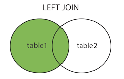

### DQL语言   其二

连接查询又称多表查询，当查询的字段来自于多个表时，就会用到连接查询

```sql
SELECT 
  查询列表 
FROM 表1 别名1 
【连接类型】 JOIN 表2 别名2 ON 连接条件 
【where 分组前筛选条件】
【group BY 分组列表】
【having 分组后筛选条件】
【order BY 排序列表】 ;
```

#### 一、内连接 inner

> 内连接：也称为等值连接，每个表中找出符合条件的共有记录 
>
> 注释：inner join 就等于 join 


- <b> 内连接：等值连接  </b> 

  ```sql
  查询员工名和对应的部门名
  SELECT
  	last_name,
  	department_name 
  FROM
  	departments d
  	INNER JOIN employees e ON e.`department_id` = d.`department_id`;
  ```

- <b> 内连接：非等值连接 </b> 

  ```sql
  查询员工的工资和工资级别
  SELECT
  	salary,
  	grade_level 
  FROM
  	employees e
  	INNER JOIN job_grades g ON e.`salary` BETWEEN g.`lowest_sal` 
  	AND g.`highest_sal`;
  ```

- <b> 内连接：自连接  </b>

  ```sql
  查询员工名和它对应上级的名称
  SELECT
  	e.last_name,
  	m.last_name 
  FROM
  	employees e
  	INNER JOIN employees m ON e.`manager_id` = m.`employee_id`;
  ```

- <b>内连接: 其它写法 </b>

  - 第一种写法：（只使用where）
  
    ```sql
    SELECT
    	t.teacher_name,
    	s.student_name 
    FROM
    	teacher t,
    	student s 
    WHERE
    	t.id = s.teacher_id;
    ```
    
  - 第二种写法：（join .. on.. ）
  
    ```sql
    SELECT
    	t.teacher_name,
    	s.student_name 
    FROM
    	teacher t
    	JOIN student s ON t.id = s.teacher_id;
    ```
  
  - 第三种写法：（inner join .. on.. ）
  
    ```sql
    SELECT
    	t.teacher_name,
    	s.student_name 
    FROM
    	teacher t
    	INNER JOIN student s ON t.id = s.teacher_id;
    ```

#### 二、外连接

- <b>左外连接：left 【outer】 </b> （左边的是主表）

  >   取左边的表的全部，右边的表按条件，符合的显示，不符合则显示null 
  >
  >  select <select list> from A left join B on A.id=B.id 

  

  ```sql
  查询哪个部门没有员工
  SELECT
  	d.`department_name` 
  FROM
  	departments d
  	LEFT OUTER JOIN employees e ON d.`department_id` = e.`department_id` 
  WHERE
  	e.`employee_id` IS NULL;
  ```

- <b>右外连接：right 【outer】 </b>（右边的是主表）

  >  取右边的表的全部，左边的表按条件，符合的显示，不符合则显示null 
  >
  >  select <select list> from A right join B on A.id=B.id 

  

  

  ```sql
  查询哪个部门没有员工
  SELECT
  	d.`department_name` 
  FROM
  	employees e
  	RIGHT OUTER JOIN departments d ON d.`department_id` = e.`department_id` 
  WHERE
  	e.`employee_id` IS NULL;
  ```

### 三、<b>交叉连接(笛卡尔积 )：cross </b> 

-  <b>交叉连接</b> 返回左表中的所有行，左表中的每一行与右表中的所有行组合。

  > 笛卡尔乘积是指在数学中，两个集合x和y的笛卡尓积，表示为X × Y，第一个对象是*X*的成员而第二个对象是*Y*的所有可能有序对的其中一个成员
  >
  > 举例：有两个集合A和B,  A = {0,1}   B = {2,3,4}
  >
  > 集合 A×B 和 B×A的结果集就可以分别表示为以下这种形式：
  >
  > A×B = {（0，2），（0，3），（0，4），（1，2），（1，3），（1，4）}；
  >
  > B×A = {（2，0），（2，1），（3，0），（3，1），（4，0），（4，1）}；
  >
  > 以上A×B和B×A的结果就可以叫做两个集合相乘的‘笛卡尔积’。
  >
  > 从以上的数据分析我们可以得出以下两点结论：
  >
  > 1，两个集合相乘，不满足交换率，既 A×B ≠ B×A;
  >
  > 2，A集合和B集合相乘，包含了集合A中元素和集合B中元素相结合的所有的可能性。
  >
  > 既两个集合相乘得到的新集合的元素个数是 A集合的元素个数 × B集合的元素个数;

  交叉连接有两种，显式的和隐式的，不带ON子句，返回的是两表的乘积，也叫笛卡尔积。
  例如：下面的语句1和语句2的结果是相同的。

  ```sql
  语句1：隐式的交叉连接，没有CROSS JOIN
  SELECT O.ID, O.ORDER_NUMBER, C.ID, C.NAME FROM ORDERS O, CUSTOMERS C WHERE O.ID=1;
  
  语句2：显式的交叉连接，使用CROSS JOIN。
  SELECT O.ID, O.ORDER_NUMBER, C.ID, C.NAME FROM ORDERS O CROSS JOIN CUSTOMERS C WHERE O.ID=1;
  ```

  ```sql
  使用交叉连接进行笛卡尔乘积查询
  SELECT   b.*,   bo.*  FROM beauty b  CROSS JOIN boys bo ;
  ```

####  四、内连接和where的区别

> 数据库表连接数据行匹配时所遵循的算法就是以上提到的笛卡尔积，表与表之间的连接可以看成是在做乘法运算。
>
> 笛卡尔乘积现象：表1 有m行，表2有n行，结果=m*n行
>

  比如现在数据库中有两张表，student表和 student_subject表，如下所示：

 <div overflow=hidden>
	
	
</div>

我们执行以下的sql语句，只是纯粹的进行表连接。

```sql
SELECT * from student JOIN student_subject;
SELECT * from student_subject JOIN student;
```

 <div overflow=hidden>
	
	
</div>

从执行结果上来看，结果符合我们以上提出的两点结论（红线标注部分）；

以第一条sql语句为例我们来看一下他的执行流程，

1. <font color=red>from语句把student表 和 student_subject表从数据库文件加载到内存中</font>

2. <font color=red>join语句相当于对两张表做了乘法运算，把student表中的每一行记录按照顺序和student_subject表中记录依次匹配</font>

3. 匹配完成后，我们得到了一张有 （student中记录数 × student_subject表中记录数）条的临时表。 

   在内存中形成的临时表如表1.0所示。我们又把内存中表1.0所示的表称为笛卡尔积表。　　

再看一下sql中主要关键字的执行顺序：

``` from  on  join  where  group by  having  select  distinct  union  order by  ```

 我们看到on是在join和where前面的

​    如果两张表的数据量都比较大的话，那样就会占用很大的内存空间这显然是不合理的。所以，我们在进行表连接查询的时候一般都会使用JOIN xxx ON xxx的语法，ON语句的执行是在JOIN语句之前的，也就是说<font color=red>两张表数据行之间进行匹配的时候，会先判断数据行是否符合ON语句后面的条件，再决定是否JOIN</font>。

　　因此，有一个显而易见的SQL优化的方案是，当两张表的数据量比较大，又需要连接查询时，<font color=red>应该使用 FROM table1 JOIN table2 ON xxx的语法，避免使用 FROM table1,table2 WHERE xxx 的语法</font>，因为后者会在内存中先生成一张数据量比较大的笛卡尔积表，增加了内存的开销。


参考文档

https://blog.csdn.net/wcc27857285/article/details/86439313

https://blog.csdn.net/qq_38490457/article/details/107640904

