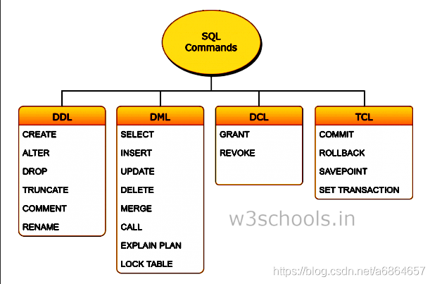
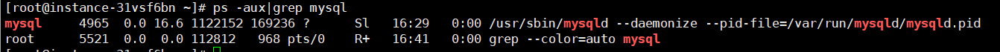

#### 一、MySQL语言分类：



- <b>DML：</b>数据操作语言，对数据查询、增加、修改、删除，如select、insert、update、delete、explain plan

- <b>DDL：</b>数据库定义语言，数据库、表、索引、视图、存储过程、触发器的管理，如create、alter、truncate

- <b>TCL：</b>事务处理语言，对事务进行处理，包括begin[set] transaction、commit、rollback、savepoint
- <b>DCL：</b>数据控制语言，进行授权与权限回收，如grant、revoke

### 二、数据库的启动

 - <b>ubuntu</b>

   ```
   service mysql status  	查看MySQL服务状态
   service mysql stop    	停止MySQL服务
   service mysql start   	启动MySQL服务
   service mysql restart 	重启MySQL服务
   ```

 - <b>centos</b>

   ```
   systemctl status mysqld.service   查看MySQL服务状态
   systemctl stop mysqld.service     停止MySQL服务
   systemctl start mysqld.service    启动MySQL服务
   systemctl restart mysqld.service  重启MySQL服务
   ```

- <b>查看mysql 运行</b>

  ```
  ps -aux|grep mysql
  ```

  

  ```python
  ps 查看当前系统中的进程
  a  表示所有用户
  -u 表示显示用户名
  -x 表示显示所有的执行程序
  ```

### 三、配置文件介绍

- <b>查看配置文件</b>

  ```python
  mysql --help|grep 'my.cnf'
  
  order of preference, my.cnf, $MYSQL_TCP_PORT,
  /etc/my.cnf /etc/mysql/my.cnf /usr/etc/my.cnf ~/.my.cnf
  ```

  mysql默认会搜寻my.cnf的目录，顺序排前的优先。

- <b>配置文件路径</b>，阿里云服务器mysql配置文件生效位置

  ```
  /etc/my.cnf           
  ```

-  **主要配置信息说明:** 

  ```linux
  port          表示端口号，默认为3306
  bind-address  表示服务器绑定的ip，默认为127.0.0.1
  datadir       表示数据库保存路径，默认为/var/lib/mysql
  log_error     表示错误日志，默认为/var/log/mysqld.log
  socket        /var/lib/mysql/mysql.sock
  ```

  注： Ubuntu 配置文件   `/etc/mysql/mysql.conf.d/mysqld.cnf `

### 四、数据库登录 

- 方法一

  ```python
  mysql -uroot -p 数据库名称
  ```

- 方法二

  ```python
  mysql -h主机名 -P端口号 -u用户名 -p密码
  
  mysql -h主机地址 -u用户名 －p用户密码  –P端口 –D数据库  –e 'SQL 内容'
  ```

### 五、MySQL语句

- 登录数据库: mysql -uroot -p
- 退出数据库: quit 或者 exit 或者 ctr + d
- 创建数据库: create database 数据库名 charset=utf8;
- 使用数据库: use 数据库名;
- 删除数据库: drop database 数据库名;
- 创建表: create table 表名(字段名 字段类型 约束, ...);
- 修改表-添加字段: alter table 表名 add 字段名 字段类型 约束
- 修改表-修改字段类型: alter table 表名 modify 字段名 字段类型 约束
- 修改表-修改字段名和字段类型: alter table 表名 change 原字段名 新字段名 字段类型 约束
- 修改表-删除字段: alter table 表名 drop 字段名;
- 删除表: drop table 表名;
- 查询数据: select * from 表名; 或者 select 列1,列2,... from 表名;
- 插入数据: insert into 表名 values (...) 或者 insert into 表名 (列1,...) values(值1,...)
- 修改数据: update 表名 set 列1=值1,列2=值2... where 条件
- 删除数据: delete from 表名 where 条件

