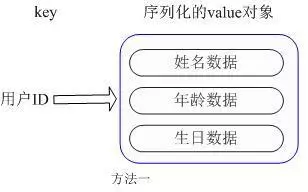
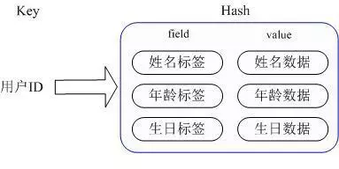

### 2.2.7 Redis实际应用场景

##### 一、Redis常用数据类型

Redis最为常用的数据类型主要有以下五种：String、Hash、List、Set、Sorted set

##### 二、各种数据类型应用和实现方式

###### 2.1  String

- String 数据结构是简单的key-value类型，value其实不仅是String，也可以是数字。

- 常用命令：get、set、incr、decr、mget等。

- 应用场景：String是最常用的一种数据类型，普通的key/ value 存储都可以归为此类，还可以享受Redis的定时持久化，操作日志及 Replication等功能， 还提供了下面一些操作： 

  ```SQL
  获取字符串长度
  往字符串append内容
  设置和获取字符串的某一段内容
  设置及获取字符串的某一位（bit）
  批量设置一系列字符串的内容
  ```

- <b>使用场景</b>：常规key-value缓存应用。常规计数: 微博数, 粉丝数。
- 实现方式：String在redis内部存储默认就是一个字符串，被redisObject所引用，当遇到incr,decr等操作时会转成数值型进行计算，此时redisObject的encoding字段为int。

###### 2.2 Hash

- 常用命令：hget,hset,hgetall 等。

- 应用场景：我们简单举个实例来描述下Hash的应用场景，比如我们要存储一个用户信息对象数据，包含以下信息：用户ID为查找的key，存储的value用户对象包含姓名，年龄，生日等信息，如果用普通的key/value结构来存储，主要有以下2种存储方式：

  

​	<b>第一种:</b> 方式将用户ID作为查找key,把其他信息封装成一个对象以序列化的方式存储

​	这种方式的缺点是，增加了序列化/反序列化的开销，并且在需要修改其中一项信息时，需要把整个对象取回，	并且修改操作需要对并发进行保护，引入CAS等复杂问题。



​	<b>第二种:</b>方法是这个用户信息对象有多少成员就存成多少个key-value对儿，用用户ID作为唯一标识来取得对应属	性的值。这里同时需要注意，Redis提供了接口(hgetall)可以直接取到全部的属性数据，但是如果内部Map的成	员很多，那么涉及到遍历整个内部Map的操作，由于Redis单线程模型的缘故，这个遍历操作可能会比较耗时，	而另其它客户端的请求完全不响应，这点需要格外注意。

- <b>使用场景</b>：存储部分变更数据，如用户信息等。

- <b>实现方式：</b>上面已经说到Redis Hash对应Value内部实际就是一个HashMap

  Hash的成员比较少时Redis为了节省内存会采用类似一维数组的方式来紧凑存储，

  当成员数量增大时会自动转成真正的HashMap，此时encoding为ht

##### 2.3 List

- 常用命令：lpush,rpush,lpop,rpop,lrange等
- <b>应用场景</b>：Redis list的应用场景非常多，比如twitter的关注列表，粉丝列表等都可以用Redis的list结构来实现。我们可以轻松地实现最新消息排行等功能

- 可以利用List的PUSH操作，将任务存在List中，然后工作线程再用POP操作将任务取出进行执行。Redis还提供了操作List中某一段的api，你可以直接查询，删除List中某一段的元素。

- <b>实现方式</b>：Redis list的实现为一个双向链表，即可以支持反向查找和遍历，更方便操作，不过带来了部分额外的内存开销，Redis内部的很多实现，包括发送缓冲队列等也都是用的这个数据结构。

  Redis的list是每个子元素都是String类型的双向链表，可以通过push和pop操作从列表的头部或者尾部添加或者删除元素，这样List即可以作为栈，也可以作为队列。 


- <b>使用场景</b>：

  消息队列系统,使用list可以构建队列系统，使用sorted set甚至可以构建有优先级的队列系统。

  取最新N个数据的操作, 记录前N个最新登陆的用户Id列表，超出的范围可以从数据库中获得。

  ```sql
  把当前登录人添加到链表里
  ret = r.lpush("login:last_login_times", uid)
  
  保持链表只有N位
  ret = redis.ltrim("login:last_login_times", 0, N-1)
  
  获得前N个最新登陆的用户Id列表
  last_login_list = r.lrange("login:last_login_times", 0, N-1)
  ```

  比如sina微博：

  在Redis中我们的最新微博ID使用了常驻缓存，这是一直更新的。但是我们做了限制不能超过5000个ID，因此我们的获取ID函数会一直询问Redis。只有在start/count参数超出了这个范围的时候，才需要去访问数据库。

  我们的系统不会像传统方式那样“刷新”缓存，Redis实例中的信息永远是一致的。SQL数据库（或是硬盘上的其他类型数据库）只是在用户需要获取“很远”的数据时才会被触发，而主页或第一个评论页是不会麻烦到硬盘上的数据库了。

  

  ##### 2.4 set

  常用命令：sadd,spop,smembers,sunion 等。

  <b>应用场景：</b>Redis set对外提供的功能与list类似是一个列表的功能，特殊之处在于set是可以自动排重的，当你需要存储一个列表数据，又不希望出现重复数据时，set是一个很好的选择，并且set提供了判断某个成员是否在一个set集合内的重要接口，这个也是list所不能提供的。

  Set 就是一个集合，集合的概念就是一堆不重复值的组合。利用Redis提供的Set数据结构，可以存储一些集合性的数据。

  案例：在微博应用中，可以将一个用户所有的关注人存在一个集合中，将其所有粉丝存在一个集合。Redis还为集合提供了求交集、并集、差集等操作，可以非常方便的实现如共同关注、共同喜好、二度好友等功能，对上面的所有集合操作，你还可以使用不同的命令选择将结果返回给客户端还是存集到一个新的集合中。

  

  Set是集合，是String类型的无序集合，set是通过hashtable实现的，概念和数学中个的集合基本类似，可以交集，并集，差集等等，set中的元素是没有顺序的。

  <b>实现方式：</b> set 的内部实现是一个 value永远为null的HashMap，实际就是通过计算hash的方式来快速排重的，这也是set能提供判断一个成员是否在集合内的原因。

  使用场景：交集，并集，差集：(Set)

  ```python
  book表存储book名称
  
  set book:1:name   ”The Ruby Programming Language”
  set book:2:name   ”Ruby on rail”
  set book:3:name   ”Programming Erlang”
  ```

  ```sql
  tag表使用集合来存储数据，因为集合擅长求交集、并集
  
  sadd tag:ruby 1
  sadd tag:ruby 2
  sadd tag:web 2
  sadd tag:erlang 3
  ```

  ```sql
  即属于ruby又属于web的书？
  inter_list = redis.sinter("tag.web", "tag:ruby") 
  
  即属于ruby，但不属于web的书？
  inter_list = redis.sdiff("tag.ruby", "tag:web") 
  
  属于ruby和属于web的书的合集？
  inter_list = redis.sunion("tag.ruby", "tag:web")
  ```

​		获取某段时间所有数据去重值，只需要不断地将数据往set中扔就行了，set意为集合，所以会自动排重。


2.5  Sorted Set

常用命令：zadd,zrange,zrem,zcard等

使用场景：Redis sorted set的使用场景与set类似，区别是set不是自动有序的，而sorted set可以通过用户额外提供一个优先级(score)的参数来为成员排序，并且是插入有序的，即自动排序。当你需要一个有序的并且不重复的集合列表，那么可以选择sorted set数据结构，比如twitter 的public timeline可以以发表时间作为score来存储，这样获取时就是自动按时间排好序的。

 和Set相比，Sorted Set增加了一个权重参数score，使得集合中的元素能够按score进行有序排列，比如一个存储全班同学成绩的Sorted Set，其集合value可以是同学的学号，而score就可以是其考试得分，这样在数据插入集合的时候，就已经进行了天然的排序。另外还可以用Sorted Set来做带权重的队列，比如普通消息的score为1，重要消息的score为2，然后工作线程可以选择按score的倒序来获取工作任务。让重要的任务优先执行。

实现方式： Redis sorted set的内部使用HashMap和跳跃表(SkipList)来保证数据的存储和有序，HashMap里放的是成员到score的映射，而跳跃表里存放的是所有的成员，排序依据是HashMap里存的score,使用跳跃表的结构可以获得比较高的查找效率，并且在实现上比较简单。