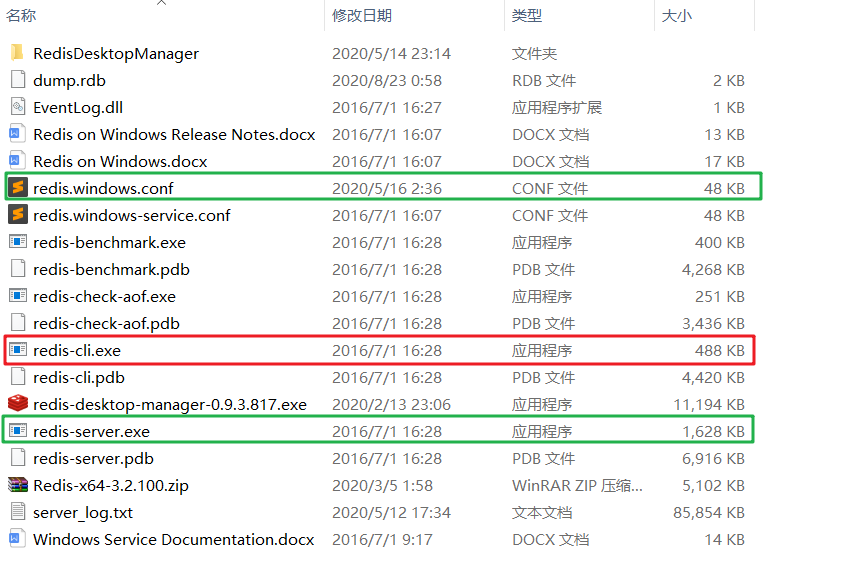
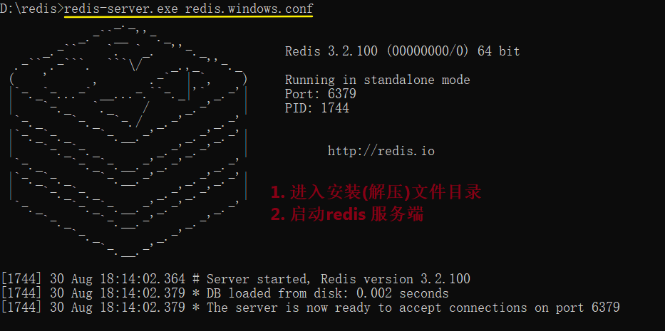

### 2.1.1 redis之windows版本安装
##### 1. 下载
   - [github](https://github.com/microsoftarchive/redis/releases)
   - [redis-download](https://github.com/microsoftarchive/redis/releases/download/win-3.2.100/Redis-x64-3.2.100.zip)

##### 2. 解压到安装目录


#### 3.启动服务端
	redis-server.exe redis.windows.conf


#### 4. 启动客户端
	Redis-cli.exe
	redis-cli.exe -h 127.0.0.1 -p 6379


#### 5. 绑定ip设置密码

进入安装目录修改redis.windows-conf文件

```linux
requirepass 1qaz2wsx
bind 0.0.0.0
```

```python
redis-cli.exe -p 6379 -a 1qaz2wsx
```


